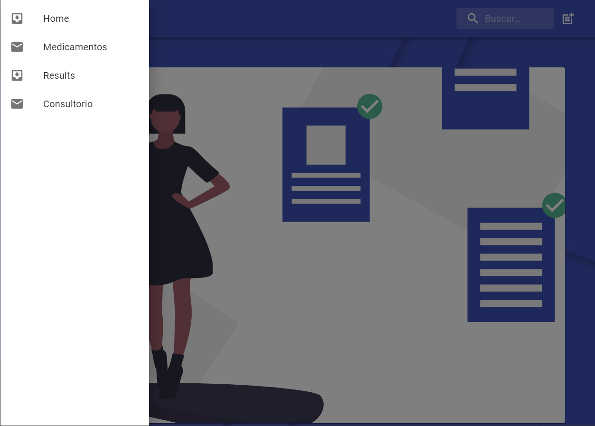
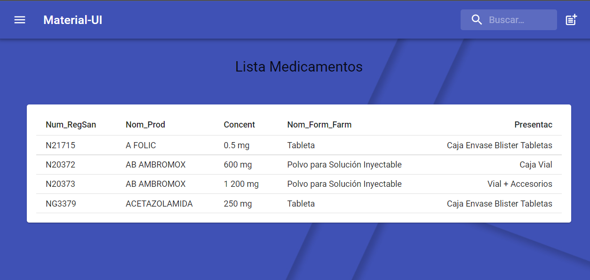
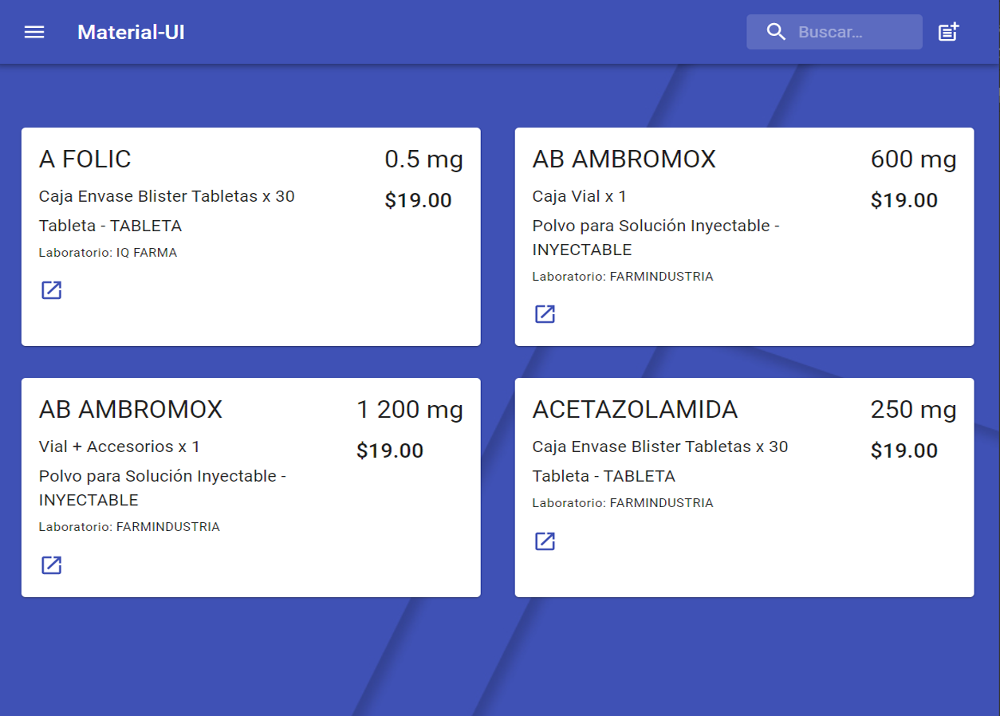
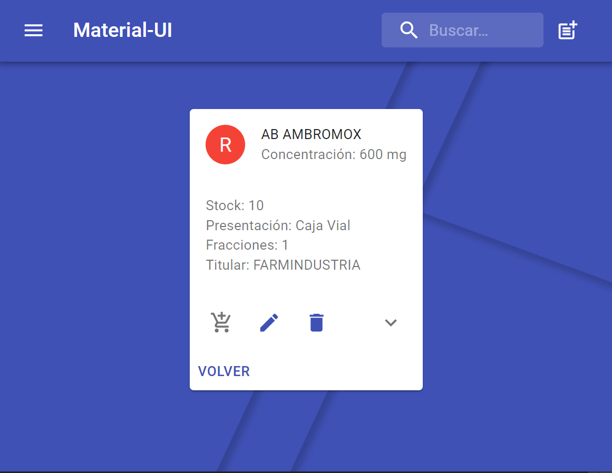
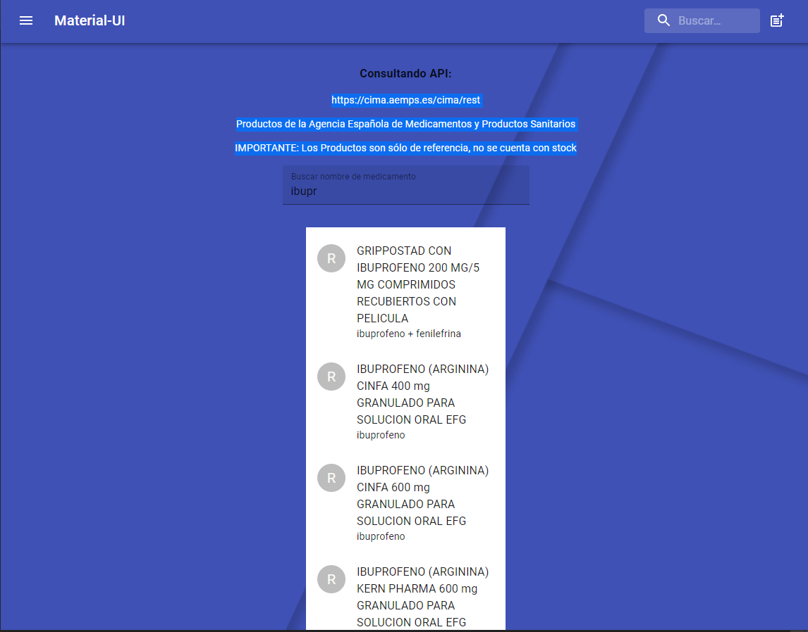
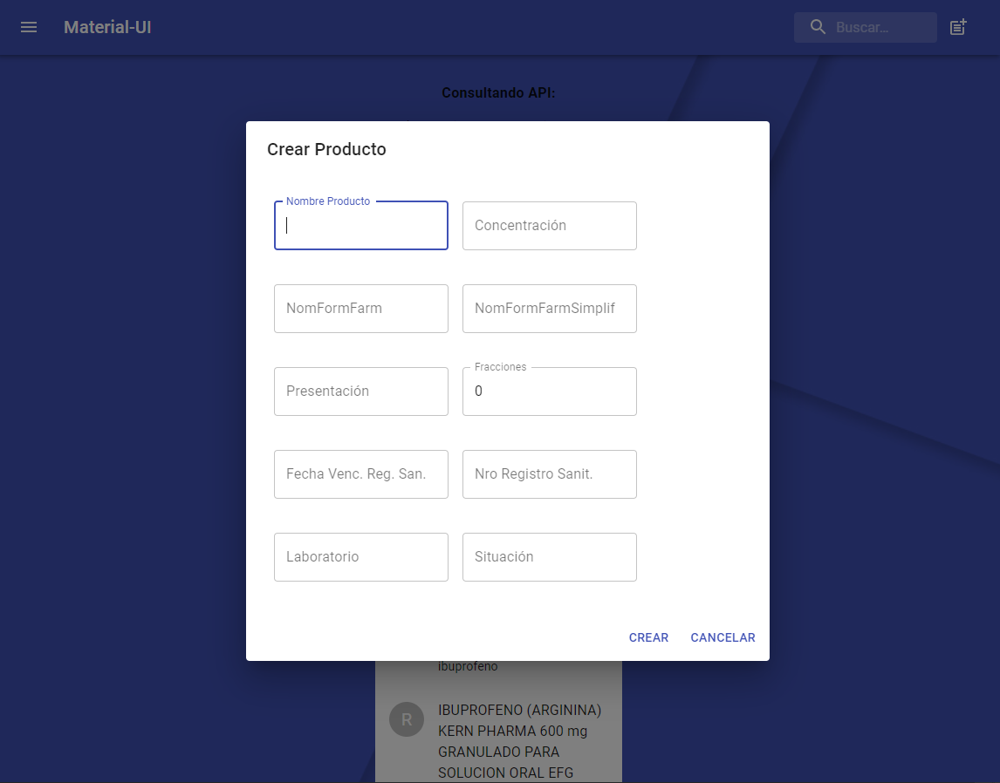

# React - Hooks - Redux

## Para cargar localmente

En la carpeta del proyecto escribir comando:

### `npm start`

Development mode.\
Open [http://localhost:3000](http://localhost:3000) to view it in the browser.

Documentación de API Rest CIMA - Medicamentos España : https://sede.aemps.gob.es/docs/CIMA-REST-API_1_19.pdf

### Previsualización 

